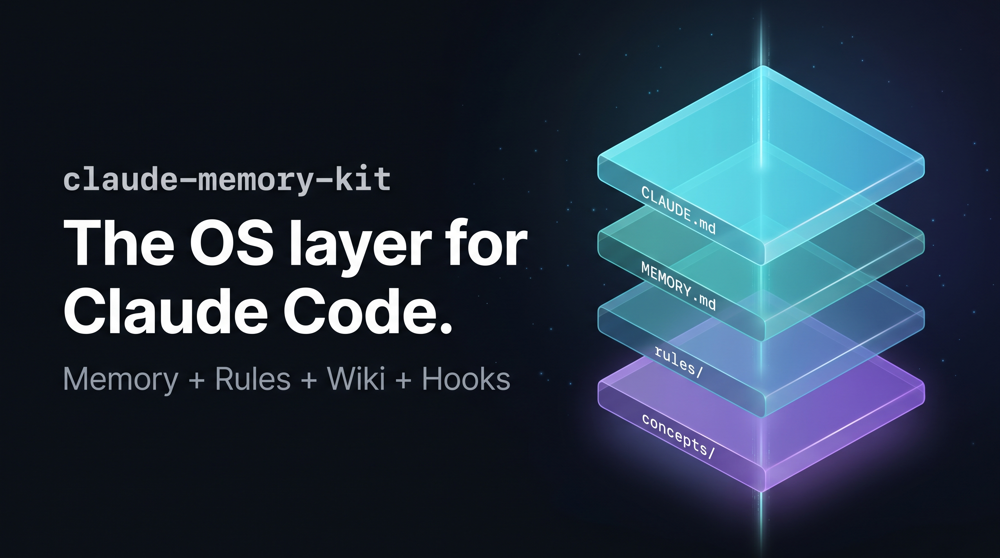
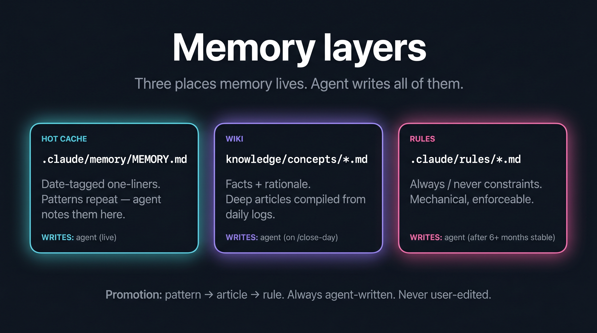
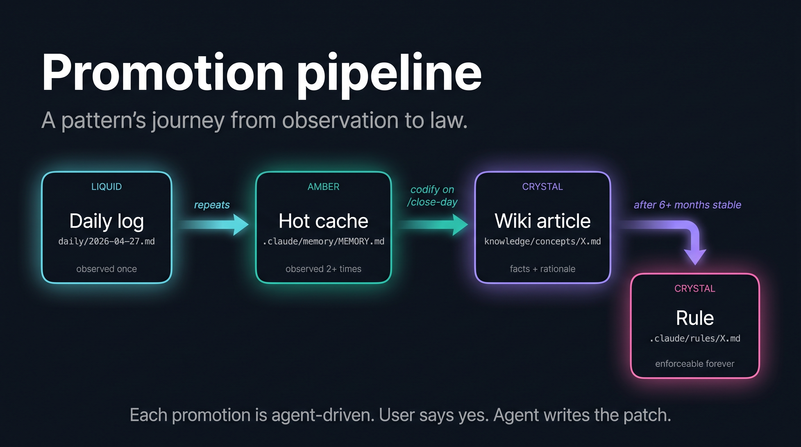
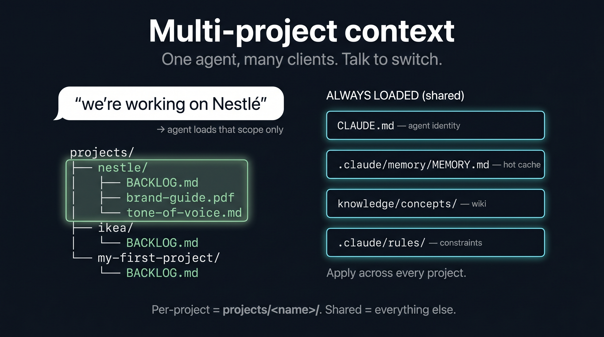
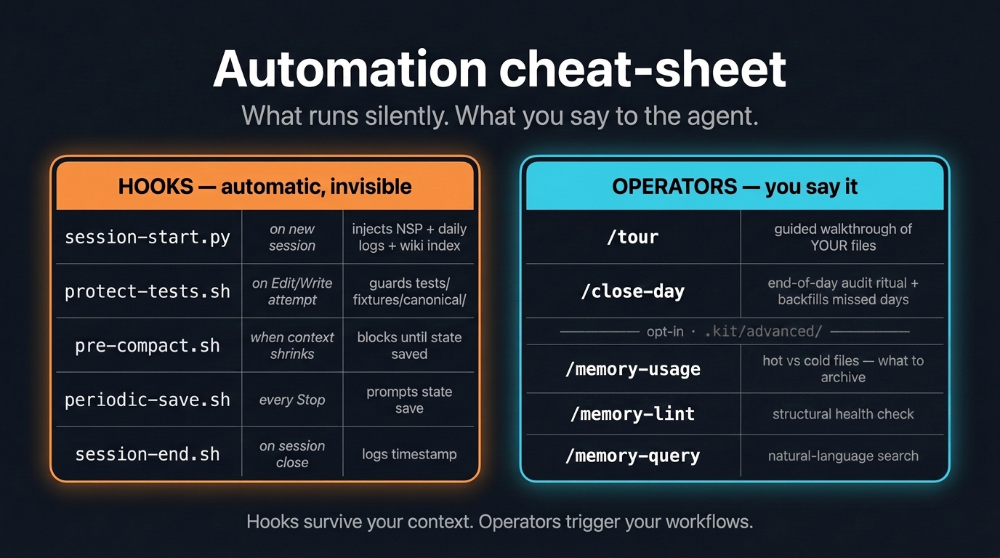

# Claude Memory Kit

**Your Claude remembers everything. Every client, every brief, every decision. Across sessions. Zero setup.**

[](https://github.com/awrshift/claude-memory-kit/releases)
[](LICENSE)
[](https://docs.anthropic.com/en/docs/claude-code/overview)

## The problem

Every time you open Claude, it forgets everything. Yesterday you locked the brand voice. Today you have to explain it again. Last week it helped you find the right campaign angle — this week you can't remember exactly how.

The first 10 minutes of every session go to re-explaining what Claude **already knew**.

**Memory Kit fixes this. Free. Runs on top of your Claude Pro or Max subscription.**

## Quick start

```bash
git clone https://github.com/awrshift/claude-memory-kit.git my-projects
cd my-projects
claude
```

That's it. Claude sets itself up and asks a couple of questions (your name, what you're working on).

> [!TIP]
> Say `/tour` after install — Claude walks you through the system using your own files.

---

## Before / after


| | Without Memory Kit | With Memory Kit |
|---|---|---|
| **New session** | "What were we working on?" | Knows the project, recent decisions, current tasks |
| **After 10 sessions** | Nothing accumulates | Searchable base of decisions, tones, patterns |
| **Multiple clients** | Chaos | Each client has its own folder, everything in place |
| **Context compaction** | Silently loses data | Hook blocks compaction until state is saved |
| **Tomorrow morning** | "Remind me what we did?" | Already knows — auto-loaded on session start |

---

## Your day


Three steps. That's the entire workflow:

### 1. Open a session
Claude auto-loads context — project state, recent decisions, knowledge base. You do nothing.

### 2. Work as usual
Talk to Claude. Write copy. Do research. Lock the tone. Safety hooks run silently — they save progress every ~50 messages and before context compacts.

### 3. Close the day
When you're done — say `/close-day`. Claude **doesn't just** dump logs. It **audits** what happened today, compares it against accumulated memory, and proposes: "noticed you rejected em-dashes in three short copies this week — make it a tone-of-voice rule?". You say "yes". It writes. Forgot to close yesterday — or all last week? It catches up: any working day with no log gets backfilled from your git history in the same pass.

**Tomorrow you continue exactly where you left off.**

---

## Memory layers



Three places memory lives. Agent writes all of them. Each layer answers a different question:

| Layer | Answers | Written by |
|---|---|---|
| `daily/YYYY-MM-DD.md` | "what happened today" | Agent (via `/close-day`) |
| `.claude/memory/MEMORY.md` | "what patterns repeat" | Agent — while you talk |
| `knowledge/concepts/*.md` | "facts and rationale by topic" | Agent — after your "yes" on `/close-day` |
| `.claude/rules/*.md` | "what must always / never happen" | Agent — after 6+ months of stable pattern |

---

## Promotion pipeline



A pattern's journey from observation to law. Agent-driven at every step. User says "yes" — agent writes the patch.

- **Week 1:** Baseline patterns captured in `MEMORY.md`. Agent starts referencing.
- **Week 2–4:** Repeated patterns surface as `/close-day` audit candidates. Wiki articles begin.
- **Month 2+:** Stable patterns crystallise into `.claude/rules/`. Full knowledge base with search.

---

## Multiple clients



Each client = their own folder. Shared layers (rules, memory, wiki) load for every project. Per-project materials load when you name the project.

Say "we're working on Nestlé" — Claude unloads other clients and loads that scope only.

---

## Hooks and operators



Five hooks run silently — they survive your context across compaction and crashes. Two slash operators give you direct control: `/close-day` (the daily ritual) and `/tour`. A few power-user commands (search, hygiene, usage stats) sit in `.kit/advanced/` for when you want them.

Everything in plain text files. No databases. No external services. `git checkout` restores anything.

---

## FAQ

<details>
<summary><b>I'm not a programmer. Will this work?</b></summary>

Yes. You talk to Claude in plain language. "Read the client brief and propose three newsletter topics" — works. Install is one command.

</details>

<details>
<summary><b>How much does it cost?</b></summary>

The kit itself is free, open source. You need a Claude Pro or Max subscription (which you probably already have). No additional cost.

</details>

<details>
<summary><b>Is my data private?</b></summary>

Yes. Everything is stored on your computer in plain text files. Nothing leaves.

</details>

<details>
<summary><b>Can I use it with an in-progress project?</b></summary>

Yes. On install, tell Claude you already have a project — it analyses it and integrates.

</details>

<details>
<summary><b>What if I forget to run /close-day?</b></summary>

Nothing breaks. Safety hooks save progress automatically. `/close-day` is the cherry on top — a deliberate end-of-day audit. And next time you do run it, it notices the days you skipped (any day with commits but no log) and offers to backfill them from your git history — so the record stays complete even if you forget for a week.

</details>

<details>
<summary><b>What if I accidentally break a memory file?</b></summary>

Everything is in git. `git checkout .claude/memory/` reverts in a second. The kit's principle is "user only talks, Claude writes" — you shouldn't be editing these files manually anyway.

</details>

<details>
<summary><b>What if I'm migrating from v3?</b></summary>

Don't try to upgrade an old project in place. Clone v4 into a new folder and tell Claude: "I have an old v3 project, help me migrate". It walks you through.

</details>

---

## What's inside

```
README.md               ← You are here
LICENSE                 ← MIT
CLAUDE.md               ← Agent's brain — who it is, how it works
SKILL.md                ← Metadata for skill aggregators
projects/               ← Real client / product folders (tasks + materials)
experiments/            ← Sandbox for hypotheses + prototypes (date-named)
daily/                  ← Daily logs (private by default, gitignored)
knowledge/              ← Knowledge base (grows over time)
context/                ← Session-to-session handoff
.claude/                ← Kit core: memory, hooks, skills, rules
.kit/                   ← Docs about the kit ITSELF (version history,
                          architecture, contributor guide) + advanced/
                          (opt-in power-user commands). The docs are safe
                          to delete after onboarding; keep advanced/ if you
                          might enable the extra commands later.
```

**`projects/` vs `experiments/`** — `projects/<name>/` for real client work (polished, indefinite lifetime, patterns promote to rules); `experiments/<name>-YYYYMMDD/` for hypotheses and prototypes (rough OK, days-to-weeks lifetime, distill into projects/concepts on close, then delete). Full spec: [`experiments/README.md`](experiments/README.md).

**Full architecture:** [.kit/ARCHITECTURE.md](.kit/ARCHITECTURE.md)
**Version history:** [.kit/CHANGELOG.md](.kit/CHANGELOG.md)
**Contributing:** [.kit/CONTRIBUTING.md](.kit/CONTRIBUTING.md)

---

## Origin

Ideas from [Andrej Karpathy](https://karpathy.ai/) and [Cole Medin](https://github.com/coleam00). Rebuilt around Anthropic-native Claude Code primitives.

700+ real sessions across 7+ projects. This is what survived all the iterations.

## Help

Issues and PRs welcome. See [.kit/CONTRIBUTING.md](.kit/CONTRIBUTING.md).

## License

MIT — see [LICENSE](LICENSE).
